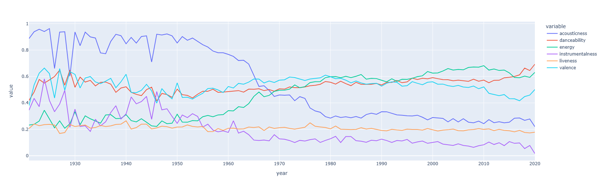
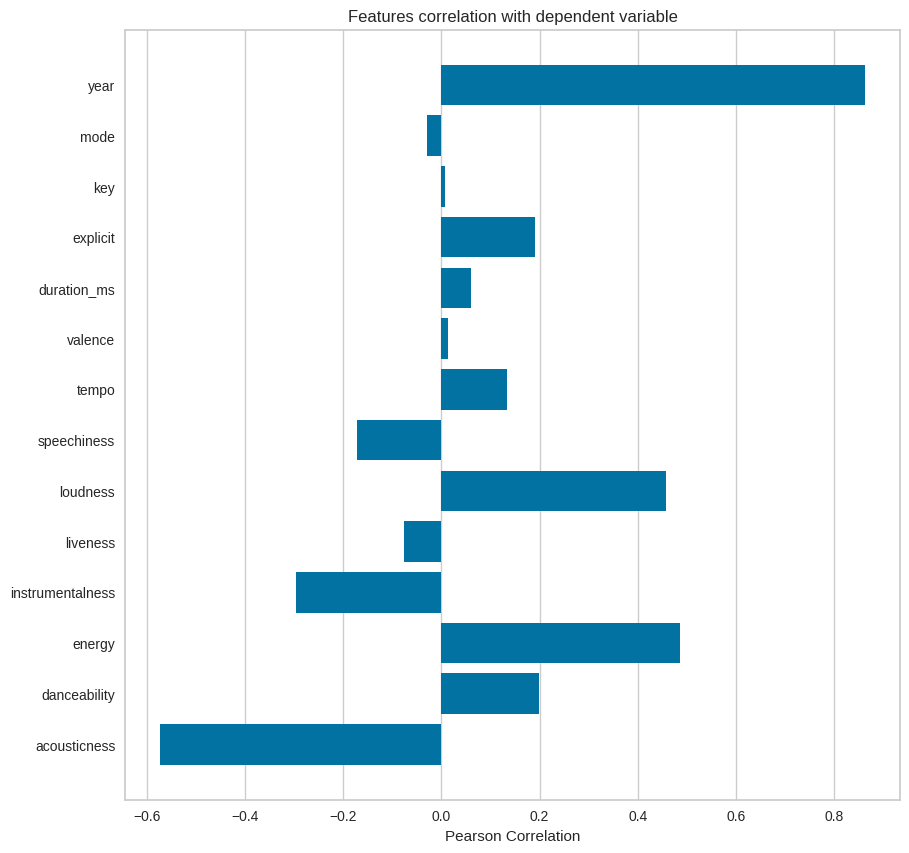
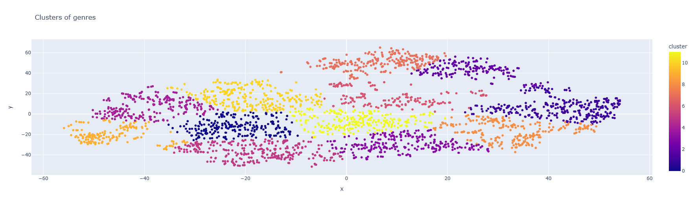
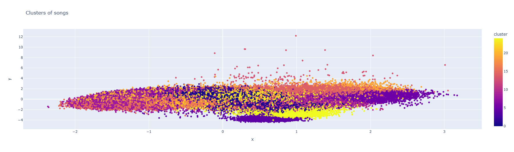

# 🎵 Music Recommendation System (Python)

A production-style **content-based music recommendation system** built in Python.  
The system recommends songs based on **audio feature similarity**, leveraging Spotify metadata and scalable machine learning pipelines.

This project emphasizes **clean software engineering practices**, reproducibility, and modular design — moving beyond notebook-only experimentation.

---

## 🚀 Overview

The goal of this project is to recommend songs based on **musical similarity**, not popularity alone.

Given one or more seed songs, the system:
1. **Extracts** numerical audio features (energy, danceability, tempo, etc.)
2. **Normalizes** and clusters songs using ML pipelines
3. **Computes** similarity using cosine distance
4. **Returns** the most similar tracks as recommendations

---

## 🧠 Key Engineering Concepts Demonstrated

* **Data preprocessing** and feature engineering  
* **Pipeline-based ML workflows** (`scikit-learn`)  
* **Similarity search** in high-dimensional spaces  
* **Clustering** (KMeans, PCA, t-SNE)  
* **External API integration** (Spotify)  
* **Environment-agnostic** file handling  


---

## 📁 Project Structure

```text
music-recommendation-system/
├── src/  
│   └── recommendation_system.py  
├── data/  
│   ├── data.csv  
│   ├── data_by_genres.csv  
│   ├── data_by_year.csv  
│   ├── data_by_artist.csv  
│   └── spotify_dataset.csv (optional)  
├── assets/  
│   └── figures/  
│       ├── Audio-Feature-Trends-Over-Time.png  
│       ├── Feature-Correlation-with-Target.png  
│       ├── Genre-Clusters.png  
│       └── Song-Clusters.png  
├── requirements.txt  
├── .gitignore  
└── README.md  
```

---

## 📊 Exploratory Analysis & Visualizations

Exploratory data analysis (EDA) was performed to validate feature selection and guide modeling decisions. Only **high-signal visualizations** that directly support the recommendation logic are included.

### 🎼 Audio Feature Trends Over Time

*Illustrates how acousticness, energy, danceability, and valence evolve over time, motivating their use as similarity signals.*

### 🔗 Feature Correlation with Popularity

*Used to identify informative features and reduce noise in downstream modeling.*

### 🧩 Genre Clustering

*Shows that genres form distinct but overlapping clusters, reinforcing continuous similarity rather than rigid labels.*

### 🎧 Song Clustering

*Supports the recommendation strategy by grouping songs in feature space and retrieving nearest neighbors via cosine distance.*

---

## ⚙️ Recommendation Logic

* **Vectorization:** Songs are represented as numerical audio feature vectors.
* **Scaling:** Features are scaled using `StandardScaler` to ensure uniform influence.
* **Metric:** Cosine distance is used to measure similarity in the high-dimensional space.
* **Output:** Nearest neighbors are returned as ranked recommendations.

---

## ▶️ How to Run

### 1️⃣ Clone the repository
```bash
git clone https://github.com/AnasAlkhawar/music-recommendation-system.git
cd music-recommendation-system
```

### 2️⃣ Install dependencies
```bash
pip install -r requirements.txt
```

### 3️⃣ Set Spotify API credentials
Create an app at the [Spotify for Developers Dashboard](https://developer.spotify.com/dashboard).

**Windows (PowerShell):**
```powershell
$env:SPOTIFY_CLIENT_ID="your_client_id"
$env:SPOTIFY_CLIENT_SECRET="your_client_secret"
```

**macOS / Linux:**
```bash
export SPOTIFY_CLIENT_ID="your_client_id"
export SPOTIFY_CLIENT_SECRET="your_client_secret"
```

### 4️⃣ Run the system
```bash
python src/recommendation_system.py
```

---

## 🛠️ Technologies Used

* **Language:** Python
* **Data:** `pandas`, `numpy`
* **ML:** `scikit-learn`, `scipy`
* **API:** `spotipy` (Spotify Web API)
* **Viz:** `matplotlib`, `seaborn`, `plotly`
* **Advanced:** `LightFM`

---

## 🔒 Security

* No secrets or API keys are committed to the repository.
* Spotify credentials are provided via local environment variables.
* Sensitive artifacts are excluded via `.gitignore`.

---

## 👤 Author

**Anas Alkhawar**  
Computer Science & Data Science Graduate  
Focused on software engineering, data-driven systems, and scalable machine learning pipelines.

---

## 📌 Why This Project Matters

This repository demonstrates:
* **Production-ready** Python code.
* Strong **data engineering** fundamentals.
* Practical **recommender-system** design.
* A clear **SWE-first mindset** applied to ML systems.
